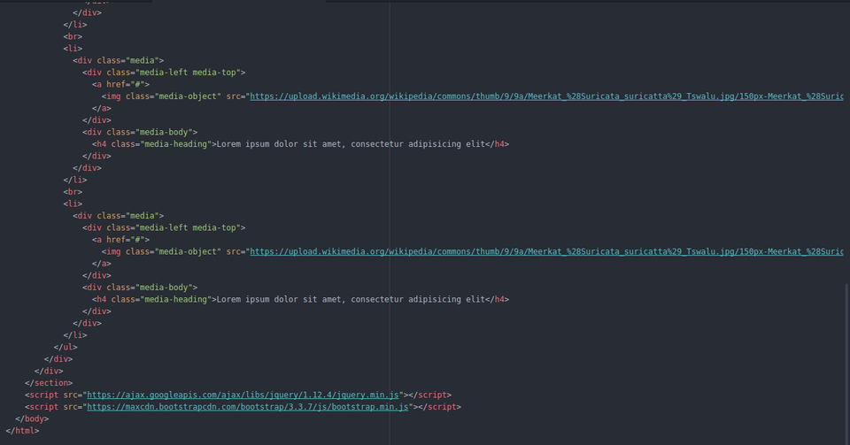
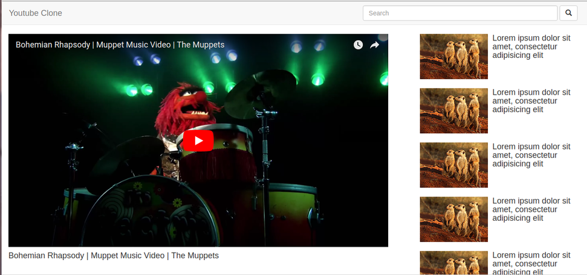

# Youtube Clone

Hey Guys,

This blog is a 20 minute guide for developing the basic UI of the Youtube Clone that I have created.
To start with we will be using the CSS Framework Bootstrap. Just to brief what is bootstrap, it is an open source toolkit for developing with HTML, CSS, and JS. You can quickly prototype your ideas or build your entire app with it's responsive grid system, extensive prebuilt components, and powerful plugins built on jQuery.

To start with the UI part, you first need to understand how this works. In the responsive grid system of bootstrap, your screen is divided into 12 columns that appropriately scales up as the device or viewport size increases. It includes predefined classes for easy layout options, as well as powerful mixins for generating more semantic layouts.Grid systems are used for creating page layouts through a series of rows and columns that house your content.
This is how it works:

1. Each row has to placed within a .container class. (Containers are the most basic layout element in Bootstrap and are required when using our default grid system. It fixes the width of the screen within which the components are to be displayed.)
2. Within each row, you have to specify the number of columns you require to position a component. This can be done using .col-md- , .col-xs- , .col-sm- , .col-lg- .
3. xs class is used for extra small devices whose width is less than 768px i.e your mobile phones.
4. sm class is used for smaller devices like tablets whose width is greater than or equal to 768px and less than 992px.
5. md class is used for screens of your laptops and desktops whose width is greater than 992px and less than 1200px.
6. lg class is used for screens whose width is greater than 1200px.

To learn more about Bootstrap, refer: https://getbootstrap.com/

#### Step 1
Now to start,
Bootstrap makes use of certain HTML elements and CSS properties that require the use of the HTML5 doctype. Include it at the beginning of all your projects.
```HTML
<!DOCTYPE html>
<html lang="en">
  ...
</html>
```

The folks over at MaxCDN graciously provide CDN support for Bootstrap's CSS and JavaScript. Just use these Bootstrap CDN links within your <head></head> tags.
```HTML
<link rel="stylesheet" href="https://maxcdn.bootstrapcdn.com/bootstrap/3.3.7/css/bootstrap.min.css">
<script src="https://maxcdn.bootstrapcdn.com/bootstrap/3.3.7/js/bootstrap.min.js"></script>
```
For your JS to work you need to include a jquery file in your template before adding the script of bootstrap.min.js.
```HTML
<script src="https://ajax.googleapis.com/ajax/libs/jquery/1.12.4/jquery.min.js"></script>
```
You can easily use the classes of Bootstrap now.

#### Step 2
Now within your <body></body> tags,
We first need to insert the navigation bar of our project that consists of the a simple search bar.
```HTML
<nav id="navbar" class="navbar navbar-default">
  <div class="container-fluid">
    <div class="navbar-header">
      <a class="navbar-brand" href="#">Youtube Clone</a>
    </div>
    <div class="collapse navbar-collapse" id="bs-example-navbar-collapse-1">
      <form class="navbar-form navbar-right" id="navBarSearchForm">
        <div class="form-group">
          <input type="text" class="form-control" placeholder="Search">
        </div>
        <button type="submit" class="btn btn-default">
          <span class="glyphicon glyphicon-search" aria-hidden="true"></span>
        </button>
      </form>
    </div>
  </div>
</nav>
```


#### Step 3
In this step, we will create a new section.
Note: In order to make your code user friendly, each and every division tag can be placed with the section tags. And each section tag can be allotted an ID that is similar to the function that part of your UI performs.
```HTML
<section id="layout" class="container-fluid"></section>
```

#### Step 4
Now within these section tags we will create our row.
```HTML
<div class="row"></div>
```

#### Step 5
Within this row we now separate the columns we wish to utilise.
If you are familiar with the youtube UI, on the screen we have two divisions. One is for the video that is to be played and other is the list of suggested videos.

For the video that is to be played I am going to allot it 8 columns and to the list 4 columns. You can change according to your convenience.

After dividing the columns on screen we now move forward to embed the video which is done as follows:
```HTML
<div class="col-md-8">
  <div class="embed-responsive embed-responsive-16by9">
    <iframe class="embed-responsive-item" src=""></iframe>
  </div>
  <h4>Title of the Video</h4>
</div>
```
Embed responsive is a pre-defined class in bootstrap that allows you to embed videos in your HTML Template.


#### Step 6
We now move to the list part. List in HTML is of 2 types ordered list and unordered list.
And each list item is placed within "li" tags.
```HTML
<div class="col-md-4">
  <ul style="list-style-type: none">
    <li>
      <div class="media">
        <div class="media-left media-top">
          <a href="#">
            
          </a>
        </div>
        <div class="media-body">
          <h4 class="media-heading">Lorem ipsum dolor sit amet, consectetur adipisicing elit</h4>
        </div>
      </div>
    </li>
    <br>
    <li>
      <div class="media">
        <div class="media-left media-top">
          <a href="#">
            
          </a>
        </div>
        <div class="media-body">
          <h4 class="media-heading">Lorem ipsum dolor sit amet, consectetur adipisicing elit</h4>
        </div>
      </div>
    </li>
    <br>
    <li>
      <div class="media">
        <div class="media-left media-top">
          <a href="#">
            
          </a>
        </div>
        <div class="media-body">
          <h4 class="media-heading">Lorem ipsum dolor sit amet, consectetur adipisicing elit</h4>
        </div>
      </div>
    </li>
    <br>
    <li>
      <div class="media">
        <div class="media-left media-top">
          <a href="#">
            
          </a>
        </div>
        <div class="media-body">
          <h4 class="media-heading">Lorem ipsum dolor sit amet, consectetur adipisicing elit</h4>
        </div>
      </div>
    </li>
    <br>
    <li>
      <div class="media">
        <div class="media-left media-top">
          <a href="#">
            
          </a>
        </div>
        <div class="media-body">
          <h4 class="media-heading">Lorem ipsum dolor sit amet, consectetur adipisicing elit</h4>
        </div>
      </div>
    </li>
  </ul>
</div>
```


After completing, your final code should look like this:




For people who are new to HTML, here are a few lines from the code which you need to understand:

1. charset="utf-8"
    Here, the charset attribute specifies the character encoding for the HTML document.
2. http-equiv="X-UA-Compatible" content="IE=edge"
    The X-UA-Compatible meta tag allows web authors to choose what version of Internet Explorer the page should be rendered as.
3. name="viewport" content="width=device-width, initial-scale=1"
    This means that the browser will render the width of the page at the width of its own screen.
4. Metadata is data about data. The <meta> tag provides metadata about the HTML document. Metadata will not be displayed on the page, but will be machine parsable.

And there a basic template of your project is ready.


